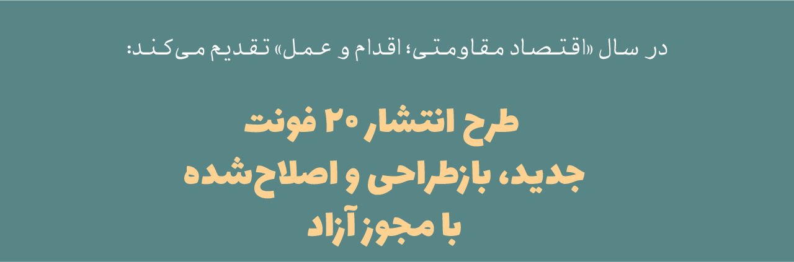
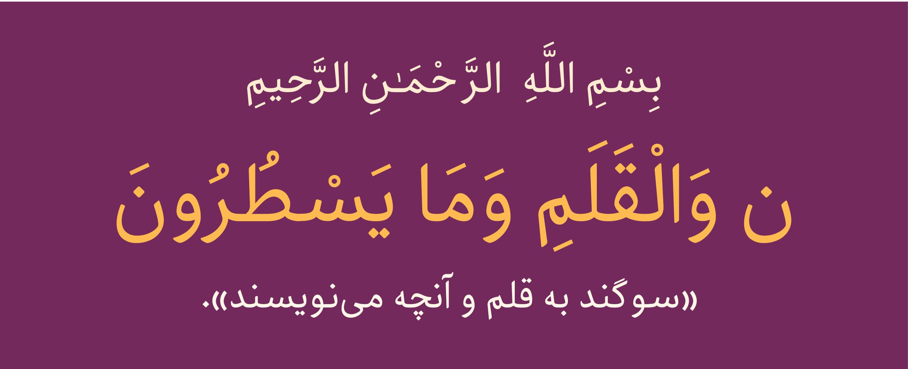
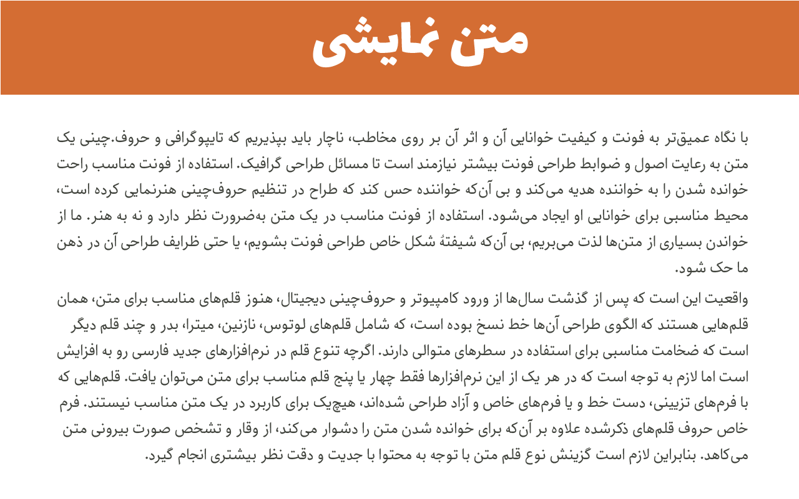
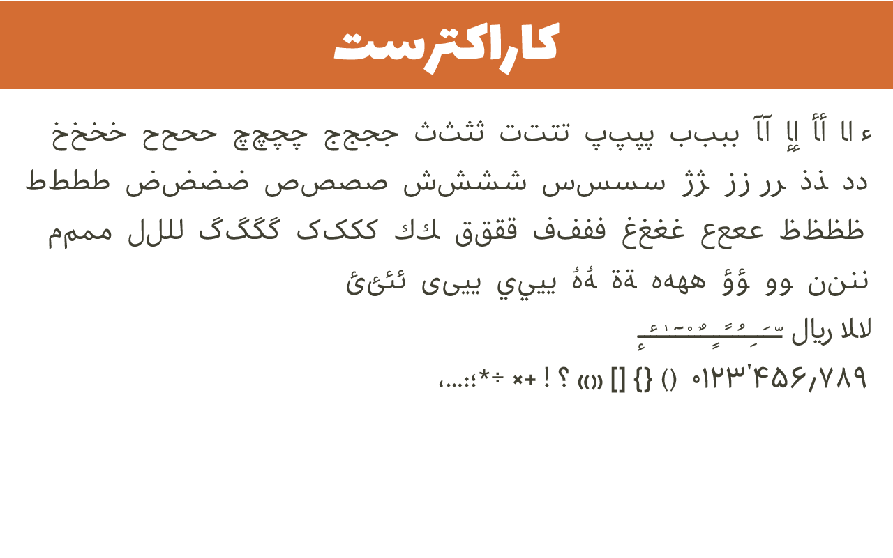

# Nika font project

Nika is a Persian/Arabic typeface, suitable for text.

## نگارش فعلی

Nika 0.1.1

## درباره فونت

تایپ‌فیس نیکا اولین تایپ‌فیس من محسوب میشه. من برنامه‌نویس هستم. اما طی یک فعالیت چهارساله برای تولید و اصلاح فونت‌های فارسی موفق نشدم با طراحان حروف فارسی به یک نقطه مشترک برسم.

این هنرمندان عزیز بسیار متکبر به دانش رمزآلود خود هستند و انتظارات بسیار زیاد و غیرمنطقی برای تولید فونت دارند.

درنهایت خودم به‌تنهایی و بدون هیچ راهنمایی یا مشاوره و فقط از طریق مهندسی‌معکوس در مدت‌زمان ۱۵ ماه تحقیق روی خط فارسی و مباحث تناسبات و … رمز و راز طراحی حروف رو استخراج و مستندنمایم.

تایپ‌فیس نیکا در کمتر از ۶ ماه تکمیل شد.

در حال حاضر هم‌روی آموزش اصول طراحی حروف فارسی کار می‌کنم. تا با انتشار این آموزش بتوانم از خط فارسی صیانت نمایم.

خط فارسی قابلیت‌های بسیار زیادی دارد. به امید آن روزی که هزاران فونت فارسی داشته باشیم.

## وضعیت توسعه

این فونت در مراحل اولیه طراحی و پیاده‌سازی قرار دارد و هنوز به حالت پایدار نرسیده است.
در صورت مشاهده هرگونه اشکال لطفاً آن را گزارش نمایید.

## برنامه توسعه

نیکا یک فونت مهندسی‌شده است. در زمان طراحی تایپ فیس چند هدف رو مدنظر داشتم.

1- کشش و قابلیت ایجاد وزن‌های متعدد را داشته باشد.

2- بتواند سبک‌های مختلف ازجمله منواسپیس و منولاین (ضخامت یکسان) را پشتیبانی نمایید.

3- هویت خط فارسی را به همراه داشته باشد و در جایگاه خود تنوع ملموسی نسبت به سایر فونت‌های دیگر داشته باشد.

در این لحظه فکر می‌کنم به آنچه مدنظر داشتم رسیده‌ام فعلاً نیاز هست. تاکمی حروف آب‌بندی شوند و به‌اصطلاح جا بیافتند تا بشود وارد مراحل بعدی شد.

## حمایت و مشارکت در توسعه فونت نیکا

پروسه و روند توسعه یک فونت کاری است بسیار ظریف و دقیق و بسیار زمان‌بر که می‌بایست با صبر و حوصله فراوان صورت گیرد. توسعه یک فونت شاید توسط یک شخص یا گروه در ابتدا آغاز گردد، اما در نهایت این فونت باید مورد تأیید مصرف کنندگانش قرار گیرید و این به این معنی است که هر فونتی خواسته یا ناخواسته می‌بایست مخاطبین خود را مورد پوشش قرار داده و نظرات آنها را دریافت و در تغییرات لحاظ نماید. و این تنها راهی ایست که می‌شود به یک فونت خوب و ایده‌عال دست پیدا کرد.

شما می‌توانید به دو صورت در توسعه این فونت مشارکت یا با ما سهیم شوید:

۱- در ابتدا باید یادآوری نماییم که فراموش نکنید که این فونت یک پروژه آزاد هست، متعلق به یک شخص و یا گروه خاص نمی‌باشد و یعنی مالکیت عمومی دارد. پس خیلی راحت و بدون هیچ عذر و بهانه‌ای در مورد فونت، چهره حروف و … نظرات خود را با ما درمیان بگذارید. یا اصلاً آستین بالا زده و با ما در بهتر شدن و تکمیل این فونت همکاری نمایید. بنده هیچ ناراحت نمی‌شوم برعکس شدیداً منتظر انتقاد و پیشنهادات شما هستم.

۲- راه دیگر حمایت مالی ایست. خوب میدانید که در شرایط فعلی ایران مخارج زندگی بسیار پرهزینه است، و این‌گونه پروژه‌ها نیاز به مشارکت عمومی یا اسپانسر مالی دارد. شما می‌توانید با حمایت مالی که در توانتان هست در رسالت «حفظ و صیانت و گسترش خط فارسی در رسانه‌های دیجیتال» با من سهیم شوید تا باهم و به کمک هم و همکاری هم از این هویت ملی پاسداری نماییم.

جهت حمایت مالی هم می‌توانید از طریق این [لینک](https://www.payping.ir/d/VWZB) اقدام نمایید.

پیش‌نمایش زنده را در [اینجا](http://font-store.github.io/font-nika/online/) مشاهده نمایید

## پیش‌نمایش

