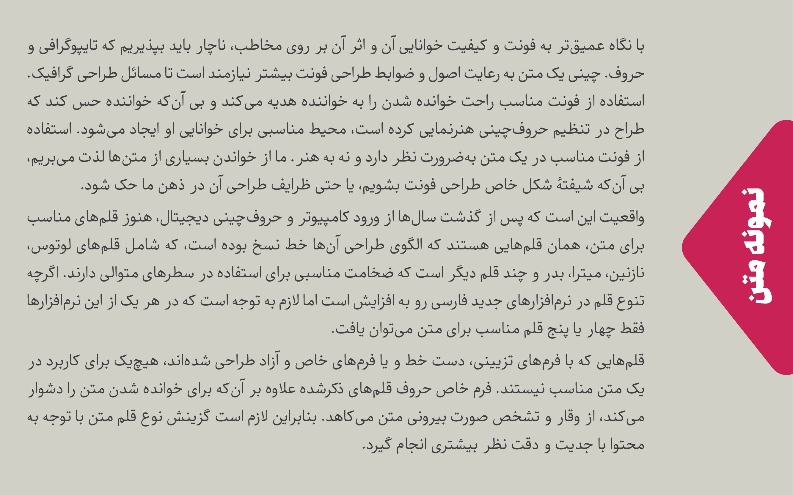
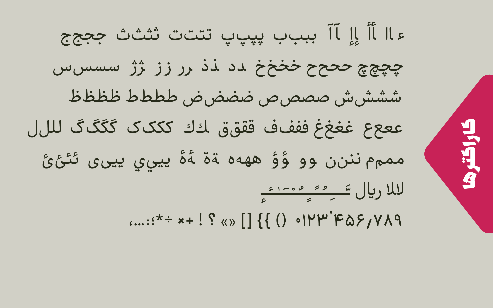

# About

- Name : Nika 
- Descrption :Nika is a Persian/Arabic font
- Designer : [Mohammad Saleh Souzanchi](http://github.com/zoghal)
- Development : [Mohammad Saleh Souzanchi](http://github.com/zoghal)
- Style : Naskh
- Usage : Web, Mobile, Print & Publishing
- Version : 1.0.0
- Download : [here](https://github.com/font-store/font-nika/releases/latest)


#  Demo & Tests

- Tecnical Test : [here](http://font-store.github.io/font-nika/online/)
- Survey 1 : [here](http://font-store.github.io/font-nika/tests/)


# Donation (روی تصویر کلیک نمایید)

[](https://www.payping.ir/d/VWZB)


## بزرگوارانی که نیکا رو مورد حمایت خود  قرار دادند:


total(rials) : ۷۰۰۰۰ تومان

total(others) : 57€
    
- [Allen Bargi](https://github.com/aziz)
- [صابر راستی کردار](https://github.com/rastikerdar)
- [محمد محبی‌فر](https://github.com/mohebifar)


# Preview





## Install

#### Linux
gnu/inux users could use [kateb](https://github.com/kiamazi/kateb) font manager, to install Nika font.

ubuntu users must install this dependensies too:
```
sudo apt install openssl libssl-dev
````

##### install kateb
```
sudo cpan kateb

kateb install nika
or
kateb update nika
```
